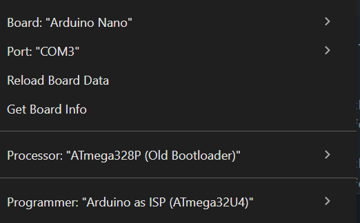

# Arduino Nano programming

- Connect the nano. Go to device manager and see which COM port
- Uninstall the device and remove the driver
- Download the driver from https://www.wch-ic.com/downloads/ch341ser_exe.html
- Run it as admin to install

Setup Arduino IDE as below:

Switch around the bootloader if it doesn't work

Use "Upload" and not "Upload using programmer"
